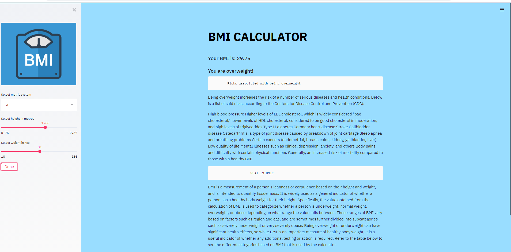

# BMI-Calculator
## WELCOME TO BMI-CALCULATOR WEBAPP: 
This is a simple and user-friendly Body Mass Index calculator app. Body mass index (BMI) is a person’s weight in kilograms divided by the square of height in meters. BMI is an inexpensive and easy screening method for weight category—underweight, healthy weight, overweight, and obesity.BMI does not measure body fat directly, but BMI is moderately correlated with more direct measures of body fat.
You can choose SI or USC metric system to enter your weight and height by using the slider provided in the sidebar. After selecting, click the Done button and you will get your BMI score and the category.
According to the category it will also display the health risks associated with respect to that category.
To run this app click the link:
 

